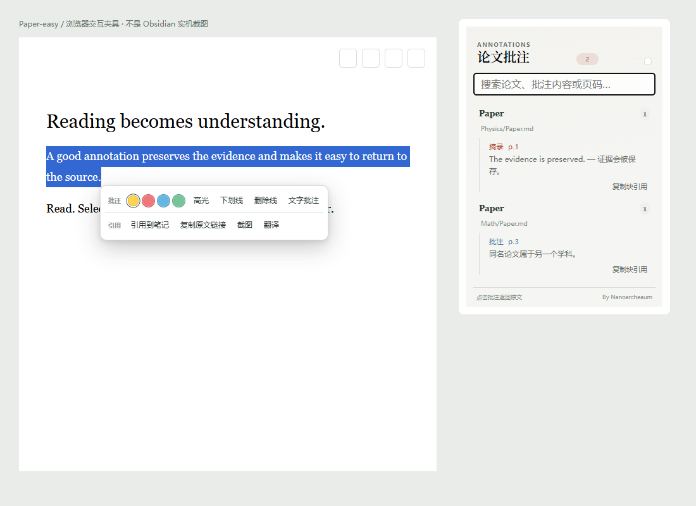

# Paper-easy

**在 Obsidian 中阅读论文、批注原文，让证据与思考留在一起。**

作者：**Nanoarcheaum** · 版本：**1.0.0**

Paper-easy 是一款轻量的 Obsidian 论文阅读与批注插件。它沿用你的文件夹体系：每篇论文对应一个 PDF 和同名 Markdown 笔记，可以分散在不同学科目录中。无需新建数据库，也不需要切换到独立工作台。

> Obsidian 中的插件显示名称为 **Paper-easy**。为了兼容已有安装，插件 ID 保持 `ai4discovering-paper-notes`。

## 功能一览

| 功能 | 使用体验 |
|---|---|
| 批量导入 | 一次选择多个 PDF，每篇可分别指定学科文件夹，自动生成论文目录和带 Paper 标签的伴随笔记。 |
| 阅读与笔记分屏 | 从插件入口打开论文，PDF 在左、笔记在右；摘录不会替换正在阅读的页面。 |
| PDF 原生批注 | 高光、下划线、删除线、文字便签，支持颜色选择、编辑与删除。批注写进 PDF。 |
| 两行右键菜单 | 选中文字后右键：批注一行、引用一行，常用操作直接可见。 |
| 一步截图 | 框选图表、公式或页面区域，截图直接进入伴随笔记，附上原页回链。 |
| 可复用的文字摘录 | 简洁引用块包含原文和页码，可从其他 Markdown 笔记嵌入并返回来源。 |
| 选段翻译 | 支持本地 Ollama 与兼容 Chat Completions 的接口；可将译文保存为 PDF 高光批注。 |
| 批注检索 | 搜索完整原文、译文和评论，按论文折叠分组，同名论文也能分别管理。 |
| 保存恢复 | PDF 写入前备份，提供未完成同步恢复及满足条件的单步撤销。 |
| Zotero 可选兼容 | 共享 PDF，将题录同步到 Markdown；无需开启此功能即可阅读与批注。 |

## 交互预览



*这是隔离浏览器测试界面的交互预览，展示菜单和边栏布局，并非真实 Obsidian 截图。*

## 安装

当前提供手动安装包；本项目尚未声明已上架 Obsidian 社区插件目录。

1. 在本仓库 [Releases](https://github.com/Nanoarcheaum/obsidian-paper-easy/releases) 页面下载 `paper-easy-1.0.0.zip`。
2. 将其中的 `ai4discovering-paper-notes` 文件夹放进你的 Vault：

   ```text
   YourVault/.obsidian/plugins/ai4discovering-paper-notes/
   ├── main.js
   ├── manifest.json
   ├── styles.css
   └── THIRD_PARTY_NOTICES.md
   ```

3. 在 Obsidian 的“设置 → 第三方插件”中启用 **Paper-easy**。

也可以单独下载 Release 中的 main.js、manifest.json、styles.css，放进同一目录。

**已有用户升级：**先关闭插件，只覆盖程序文件，再重新启用。保留原目录中的 data.json 和恢复目录，已有设置与笔记不需要迁移。不要创建带版本号的插件目录。

## 快速开始

1. 点击左侧“批量导入论文”，选择 PDF 和目标学科目录。
2. 从“Paper 文件”树打开论文。
3. 划选文字，点击右键，选择高光、文字批注、引用到笔记或翻译。
4. 需要图表时选择“截图”，拖动框选后自动保存。
5. 在其他笔记中运行“插入论文块引用”，复用已经保存的内容。

文件仍然是普通文件：

```text
YourVault/
└── Physics/
    └── Example Paper/
        ├── Example Paper.pdf
        ├── Example Paper.md
        └── figures/
            └── figure-p1-….png
```

| 快捷键 | 操作 |
|---|---|
| Ctrl/Cmd + Shift + E | 记录论文摘录 |
| Ctrl/Cmd + Shift + G | 截取图像 |
| Ctrl/Cmd + Shift + T | 翻译当前选段 |
| Esc | 关闭浮窗或取消截图 |

## 配置翻译

在插件设置中填写接口和模型，点击“测试连接”。只发送你选择的文字，不自动上传整篇论文。

| Ollama 默认项 | 值 |
|---|---|
| 接口 | `http://localhost:11434/api/chat` |
| 模型 | `qwen3:14b` |
| 目标语言 | 简体中文 |
| API Key | 可留空 |

默认值不代表机器已经部署模型；请填入自己实际可用的模型。升级保留已有配置。使用云端接口时，所选文字会发送到该服务；密钥保存在当前 Vault 的插件配置中。

## 兼容与边界

- manifest 最低 Obsidian 版本为 1.5.0；当前验证以 Windows 开发环境为主，macOS、Linux 和移动端尚未完整验收。
- 选区批注限定单页；来源链接定位到原页，不自动处理 PDF 页序改变后的重定位。
- 边栏索引来自伴随 Markdown；外部 PDF 批注可在当前 PDF 的批注管理中查看，Zotero 数据库批注不做双向同步。
- 删除插件创建的 PDF 批注也会移除关联笔记块，可能影响其他笔记的块引用。撤销要求文件没有后续变化。
- PDF 与 Markdown 保存不是文件系统原子事务；提供备份与恢复，不建议两个程序在同一时刻写入同一 PDF。

更多配置与恢复方式见 [使用指南](docs/USAGE.md)，本版验证范围见 [验证记录](docs/VALIDATION.md)。

## 开发

需要 Node.js（项目验证使用 Node.js 24）和 npm。

```sh
npm ci
npm test
npm run build
```

`npm run dev` 启动构建监听。`npm run test:ui` 运行隔离浏览器夹具，需要另行提供 Playwright 和浏览器；可用 `PAPER_EASY_PLAYWRIGHT` 指定模块位置，`PAPER_EASY_BROWSER=msedge` 选择 Edge。

`npm run package` 构建并生成发布包（另需 Python 3）。项目不将用户 Vault、模型、API 密钥或恢复数据加入发布包。

## 文档与反馈

- [1.0.0 发布说明](RELEASE_NOTES.md)
- [更新日志](CHANGELOG.md)
- [GitHub 发布指南](docs/PUBLISHING.md)
- [第三方依赖声明](THIRD_PARTY_NOTICES.md)

欢迎通过仓库 Issues 反馈问题，请提供 Obsidian 版本、操作系统、插件版本及复现步骤。提交截图或日志前请移除私人论文内容和 API 密钥。

## 作者与许可

**Nanoarcheaum**

项目许可证尚未指定。第三方依赖的原始许可声明保留在 THIRD_PARTY_NOTICES.md 中。

## 反馈

使用问题和功能建议请提交到 [GitHub Issues](https://github.com/Nanoarcheaum/obsidian-paper-easy/issues)。
